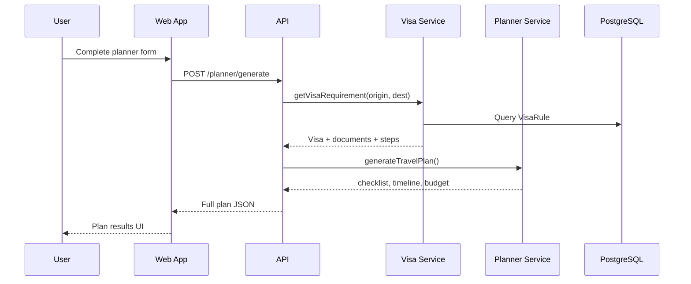

# Voyager Architecture

## System overview

Voyager is a monorepo with three packages:

1. **`@voyager/web`** — Next.js 15 App Router SPA/SSR frontend
2. **`@voyager/api`** — Express REST API with modular routes
3. **`@voyager/database`** — Prisma schema, migrations, seed data

## Data model (core entities)

```
User ──┬── Trip ──┬── ItineraryItem
       │          ├── TravelDocument
       │          ├── BudgetItem
       │          └── TripCollaborator
       └── AiChat ── AiMessage

Country ──┬── City ── ServiceCenter
          └── VisaRule (origin × destination)

CurrencyRate
KnowledgeChunk (RAG)
```

## Request flow — trip planning



## Visa engine

- **Matrix lookup:** `VisaRule` unique on `(originCountryId, destinationCountryId)`
- **Cache:** Redis key `visa:{origin}:{destination}` (10 min TTL)
- **Fallback:** Generic embassy guidance when no rule exists
- **Confidence:** Stored per rule; displayed in UI

## AI layer (RAG)

1. User message stored in `AiMessage`
2. Top knowledge chunks retrieved from `KnowledgeChunk` (keyword/category match; production: vector DB)
3. Context injected into OpenAI system prompt
4. Response stored with `citations` and `confidence`
5. Without `OPENAI_API_KEY`: deterministic fallback responses

## Auth

- bcrypt password hashing (12 rounds)
- JWT bearer tokens (`Authorization: Bearer <token>`)
- Zustand + localStorage on frontend

## Caching strategy

| Key | TTL | Data |
|-----|-----|------|
| `countries:all` | 1h | Country list |
| `visa:{o}:{d}` | 10m | Visa requirement |
| `rates:USD` | 5m | Currency rates |

## UX flows

1. **Landing** → trust, how-it-works, visa demo, FAQ
2. **Planner** → 4-step progressive disclosure → plan results
3. **Visa** → instant country-pair lookup
4. **Dashboard** → saved trips (requires auth)
5. **Mobile** → bottom navigation for core actions

## Scalability notes

- Stateless API → horizontal scaling behind load balancer
- Prisma connection pooling via PgBouncer in production
- Redis for session/cache (optional rate limit store)
- Separate worker for PDF export / email in future
- Vector DB (Pinecone/Chroma) drop-in for `KnowledgeChunk.embedding`

## Security

- Helmet headers
- CORS restricted to frontend origin
- Rate limiting (200 req / 15 min / IP)
- Zod validation on all inputs
- No secrets in client bundle (only `NEXT_PUBLIC_*`)
